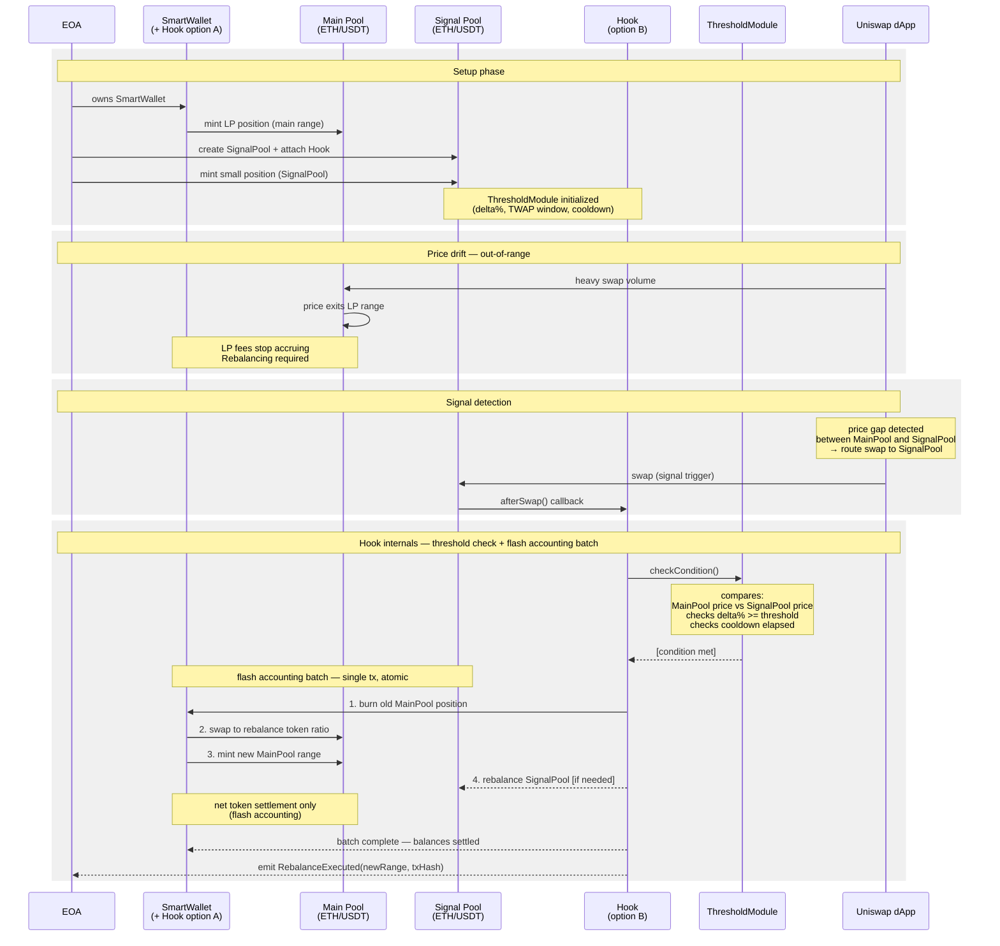

# Uniswap V4 Hook — Delta-neutral Rebalancing

## Sequence Diagram



---

## Architecture Options

| Option | Description | Pros | Cons |
|--------|-------------|------|------|
| **A** | SmartWallet + Hook as single contract | No trust issue, simpler auth, smaller attack surface | Less modular, harder to upgrade Hook independently |
| **B** | Hook as separate contract | Modular, upgradeable Hook | SmartWallet must grant allowance to Hook address |

---

## ThresholdModule Parameters

| Parameter | Description | Example |
|-----------|-------------|---------|
| `delta%` | Min price gap between MainPool and SignalPool | 0.5% |
| `twapWindow` | TWAP averaging window (manipulation protection) | 1800s (30 min) |
| `cooldown` | Min interval between rebalances | 3600s (1 hour) |

---

## Flash Accounting Batch (single atomic tx)

```
1. burn old MainPool position
2. swap to rebalance token ratio
3. mint new MainPool range (new tick range)
4. rebalance SignalPool [optional, if needed]
── net token settlement (flash accounting) ──
```

---

## Key Contracts

- **SmartWallet** — holds LP position in MainPool, trusted by Hook (Option A: merged, Option B: grants allowance)
- **SignalPool** — ETH/USDT pool with small liquidity, Hook attached, acts as price sensor
- **Hook** — implements `afterSwap()`, calls ThresholdModule, initiates rebalancing batch
- **ThresholdModule** — configurable module with rebalancing conditions (delta%, TWAP, cooldown)