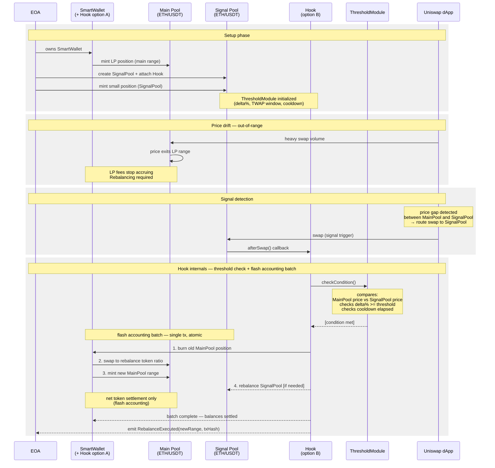

# Uniswap V4 Hook — Base Scenario Description

## Participants

| Participant | Description |
|-------------|-------------|
| **EOA** | Externally Owned Account — the owner and operator of the system |
| **SmartWallet** | Smart contract wallet holding the main LP position. In Option A: merged with Hook logic |
| **Main Pool (ETH/USDT)** | High-liquidity Uniswap V4 pool. Frequently selected by Uniswap dApp for swaps → generates significant fee revenue |
| **Signal Pool (ETH/USDT)** | Low-liquidity Uniswap V4 pool with Hook attached. Same token pair as Main Pool. Acts as a price sensor |
| **Hook** | Uniswap V4 hook contract attached to Signal Pool. In Option B: separate contract. In Option A: merged into SmartWallet |
| **ThresholdModule** | Configurable module inside Hook or SmartWallet. Evaluates rebalancing conditions |
| **Uniswap dApp** | Uniswap routing interface. Selects the best pool for each swap based on price and liquidity |

---

## Base Scenario

### 1. Setup Phase

EOA owns a SmartWallet. SmartWallet holds a concentrated liquidity position in the **Main Pool** (ETH/USDT). This pool is frequently selected by Uniswap dApp for swaps due to its deep liquidity, so the position earns substantial fee revenue.

EOA creates a **Signal Pool** with the same token pair (ETH/USDT) and attaches a **Hook** to it. A small liquidity position is minted in Signal Pool. Under stable price conditions, the probability that Uniswap dApp routes a swap through Signal Pool is very low — its liquidity is intentionally thin.

**ThresholdModule** is initialized with rebalancing parameters:
- `delta%` — minimum price gap between Main Pool and Signal Pool required to trigger rebalancing
- `twapWindow` — TWAP averaging window for manipulation protection
- `cooldown` — minimum time interval between consecutive rebalances

---

### 2. Price Drift — Out-of-Range

Heavy swap volume in Main Pool causes the ETH price to move. The price exits the tick range of the SmartWallet's LP position in Main Pool. Once out of range, the position stops earning fees. Rebalancing is required — but a reliable on-chain signal is needed to trigger it without a centralized keeper.

---

### 3. Signal Detection

As the ETH price drifts, a price gap opens between Main Pool (current market price) and Signal Pool (last traded price). When this gap becomes significant enough, Uniswap dApp may route a swap through Signal Pool because it temporarily offers a better price.

After the swap executes in Signal Pool, the attached **Hook** fires its `afterSwap()` callback. This swap event is the **rebalancing signal**.

---

### 4. Hook Internals — Threshold Check

Inside `afterSwap()`, Hook calls **ThresholdModule.checkCondition()**:

- Compares current ETH price in Main Pool vs Signal Pool
- Checks whether the price gap exceeds `delta%`
- Checks whether `cooldown` period has elapsed since last rebalance
- Optionally verifies price using TWAP to prevent manipulation

If all conditions are met, Hook proceeds to initiate rebalancing.

---

### 5. Flash Accounting Batch — Atomic Rebalancing

Hook initiates a **single atomic transaction** using Uniswap V4 flash accounting. All operations are batched — token transfers occur only once at the end as a net settlement:

1. **Burn** the existing out-of-range LP position in Main Pool
2. **Swap** tokens inside SmartWallet to restore the correct ratio for the new price range
3. **Mint** a new LP position in Main Pool centered around the current ETH price
4. **Rebalance Signal Pool** position if its range is also out of bounds (optional)
5. **Net settlement** — flash accounting resolves all intermediate balance changes in one final token transfer

On completion, Hook emits a `RebalanceExecuted(newRange, txHash)` event for off-chain monitoring.

---

## Architecture Options

### Option A — SmartWallet + Hook as a single contract
Hook logic is embedded directly inside SmartWallet. No external trust or allowance required. Simpler security model, smaller attack surface. Preferred for initial implementation.

### Option B — Hook as a separate contract
Hook is a standalone contract. SmartWallet grants an allowance to the Hook address. More modular — Hook can be upgraded or replaced independently. Preferred for production systems requiring flexibility.

---

## Sequence Diagram



---

## Architecture Options

| Option | Description | Pros | Cons |
|--------|-------------|------|------|
| **A** | SmartWallet + Hook as single contract | No trust issue, simpler auth, smaller attack surface | Less modular, harder to upgrade Hook independently |
| **B** | Hook as separate contract | Modular, upgradeable Hook | SmartWallet must grant allowance to Hook address |

---

## ThresholdModule Parameters

| Parameter | Description | Example |
|-----------|-------------|---------|
| `delta%` | Min price gap between MainPool and SignalPool | 0.5% |
| `twapWindow` | TWAP averaging window (manipulation protection) | 1800s (30 min) |
| `cooldown` | Min interval between rebalances | 3600s (1 hour) |

---

## Flash Accounting Batch (single atomic tx)

```
1. burn old MainPool position
2. swap to rebalance token ratio
3. mint new MainPool range (new tick range)
4. rebalance SignalPool [optional, if needed]
── net token settlement (flash accounting) ──
```

---

## Key Contracts

- **SmartWallet** — holds LP position in MainPool, trusted by Hook (Option A: merged, Option B: grants allowance)
- **SignalPool** — ETH/USDT pool with small liquidity, Hook attached, acts as price sensor
- **Hook** — implements `afterSwap()`, calls ThresholdModule, initiates rebalancing batch
- **ThresholdModule** — configurable module with rebalancing conditions (delta%, TWAP, cooldown)